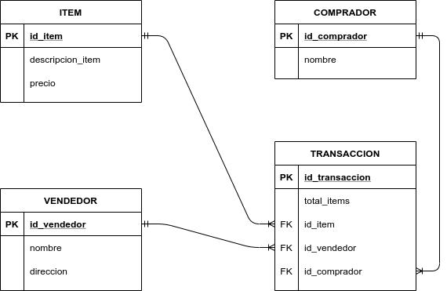

<!-- Badges -->
<p>
  
  <a href="#" target="_blank">
    
  </a>
  <a href="https://twitter.com/redacuve" target="_blank">
    
  </a>
</p>

<!-- Project Header -->
  <p align="center">
  <h1 align="center">Coding Challenge: CSV a Base de datos. </h1>
  <p align="center">
  <br>
   <a href="https://github.com/redacuve/code-challenge-csv-rails"><strong>Explora el repositorio »</strong></a>
  <br>
    <a href="https://github.com/redacuve/code-challenge-csv-rails/issues">Solicita una mejora/caracteristica </a>
  </p>
  <h2 align="center"><a href=""><strong>¡App en linea!</strong></a></h2>

<!-- INDICE DE CONTENIDO -->

## INDICE DE CONTENIDO

- [ACERCA DEL PROYECTO](#ACERCA-DEL-PROYECTO)

- [MODELO ENTIDAD RELACION](#MODELO-ENTIDAD-RELACION)

- [TECNOLOGIAS IMPLEMENTADAS](#TECNOLOGIAS-IMPLEMENTADAS)

- [COMO COMENZAR](#COMO-COMENZAR)

- [CÓMO FUNCIONA](#CÓMO-FUNCIONA)

- [CÓMO CORRER EL CÓDIGO](#CÓMO-CORRER-EL-CÓDIGO)
    - [CORRER TESTS](#CORRER-TESTS)

- [CÓMO COCIARIBUIR](#CÓMO-CONTRIBUIR)

- [LICENCIA](#LICENCIA)

- [CONTACTO](#CONTACTO)

<!-- ACERCA DEL PROYECTO -->

## ACERCA DEL PROYECTO

Es un ejercicio para una compañia ficticia que adquirio una nueva empresa y debe importar toda su información. Desafortunadamente, la empresa adquirida nunca guardó sus datos en una base de datos y siempre utilizó archivos planos delimitados por tabs.

Este proyecto toma un archivo CSV delimitado por tabs y guarda la informacion en la base de datos.

## MODELO ENTIDAD RELACION

<p align="center" background="white">

<p>

## TECNOLOGIAS IMPLEMENTADAS

- [Ruby](https://ruby-doc.org/core-2.7.0/)

- [Rails](https://guides.rubyonrails.org/getting_started.html)

- [HTML5](https://developer.mozilla.org/es/docs/HTML/HTML5)

- Gemas usadas:
  - [rubocop](https://rubygems.org/gems/rubocop)

<!-- COMO COMENZAR -->

## COMO COMENZAR

Para obtener una copia local en tu sistema LINUX / OSX, copia y sigue los siguientes pasos:

Clona o forkea el siquiente <a href="https://github.com/redacuve/code-challenge-csv-rails">repositorio</a> [git@github.com:redacuve/code-challenge-csv-rails.git]

Nota\* Ruby y Rails deben estar instalados para correr este software, en cualquier caso puedes ver la documentacion de como instalar ruby [aqui](https://www.ruby-lang.org/en/documentation/installation/) y como instalar rails [aqui](http://guides.railsgirls.com/install). Esta documentacion esta en ingles.

<!-- CÓMO FUNCIONA -->

## CÓMO FUNCIONA

Esta aplicacion tiene dos vistas, la vista principal (index) y el formulario para añadir el archivo (procesar), cuando uno usa el formulario para que se procese, este archivo es cargado temporalmente a rails, el controlador recibe por parametros el archivo cargado temporalmente y ese archivo a cada modelo.
Cada modelo se encarga de la lógica, se utilizar CSV para leer el archivo y obtener cara fila, al estar delimitadas por tabuladores se tiene que poner explicitamente que ese es el delimitador, asi que cada que se lee una fila del archivo esta es pasada a un hash, con este hash cada modelo sabe especificamente que parte necesita para crearse en la base de datos.
Con esto es posible guardar toda la informacion del archivo en la base de datos.

<!-- CÓMO CORRER EL CÓDIGO -->

## CÓMO CORRER EL CÓDIGO

- Navegar al directorio del proyecto.

- Correr el siguiente comando para instalar las gemas usadas:
  ```
  $ bundle install
  ```
- Instalar Yarn
  ```
  $ yarn install --check-files
  ```
- Crear y migrar la base de datos.
  ```
  $ rails db:create
  $ rails db:migrate
  ```
- Correr el servidor de desarollo con el siguiente comando
  ```
  $ rails server
  ```
- Abrir la aplicacion en el navegador con la siguiente dirección.
  ```
  http://127.0.0.1:3000/
  ```
<!-- CORRER TESTS -->

### CORRER TESTS

Para correr los test es tan simple como ejecutar el siguiente comando dentro de la carpeta del proyecto
```
$ rails test test/models/
```
Esto correra los minitest para los modelos.
<!-- CÓMO CONTRIBUIR -->

## CÓMO CONTRIBUIR

Las contribuciones son lo que hacen que la comunidad de código abierto sea un lugar tan increíble para aprender, inspirar y crear. 
Cualquier contribución que haga es **MUY APRECIADA**.

1. Haz fork del proyecto

2. Crear una branch con tu caracteristica (`git checkout -b caracteristica/TuNuevaCaracteristica`)

3. Haz commit de los cambios (`git commit -m 'Agregada una caracteristica nueva'`)

4. Haz un push a la Branch (`git push origin caracteristica/TuNuevaCaracteristica`)

5. Abre un Pull Request

<!-- LICENCIA -->

## LICENCIA

Este proyecto esta bajo la <a href="https://www.gnu.org/licenses/gpl-3.0.html">GNU Public License V3</a>. Para mas informacion sobre la licencia <a href="https://github.com/redacuve/code-challenge-csv-rails/blob/master/LICENSE">dar click aqui</a>

<!-- CONTACTO -->

## CONTACTO

Rey David Cuevas Vela - [@redacuve](https://twitter.com/redacuve) - [redacuve@gmail.com](mailto:redacuve@gmail.com) -[linkedin.com/in/redacuve/](https://www.linkedin.com/in/redacuve/)

Link del Proyecto: [github.com/redacuve/code-challenge-csv-rails](https://github.com/redacuve/code-challenge-csv-rails) - Coding Challenge: CSV a Base de datos.
